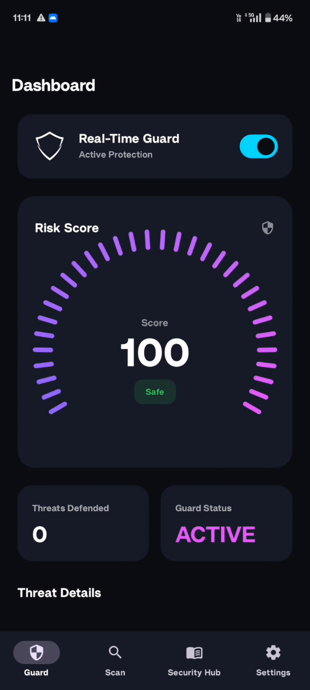
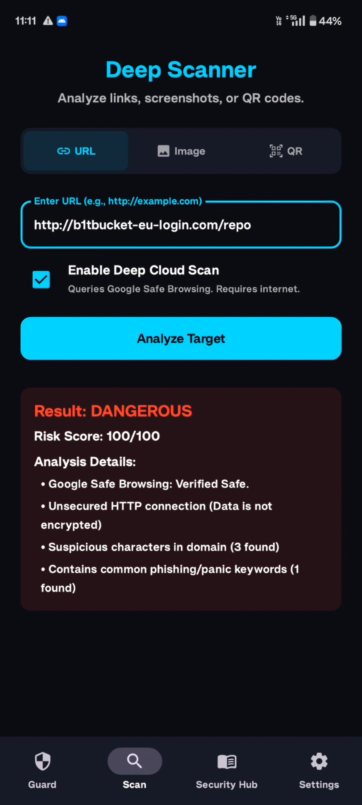
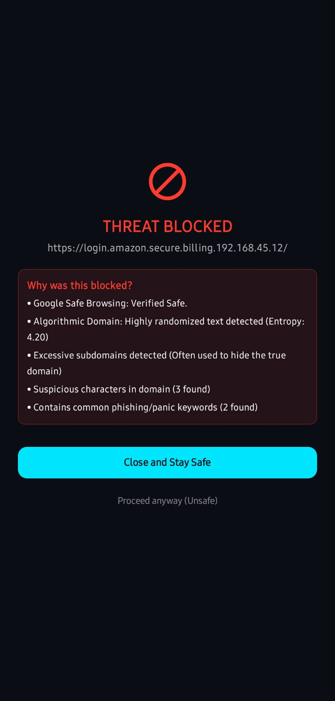

# ANZEN
Real-time Android phishing defense platform featuring URL interception, entropy-based threat detection, homograph analysis, and on-device security intelligence.

<div align="center">


# Anzen

### Enterprise-Grade Phishing Defense & Intent Firewall for Android

[](https://anzen.pages.dev)
[](https://github.com/fahim-stepsup/ANZEN/releases/latest)


*Zero-knowledge. Real-time. Fully on-device.*

Anzen is a real-time security engine for Android that intercepts zero-day phishing links, calculates domain entropy, strips invisible trackers, and blocks malicious sites in milliseconds — all running 100% locally on your device.

[Download APK](https://github.com/fahim-stepsup/ANZEN/releases/latest) • [Official Website](https://anzen.pages.dev) • [Report a Bug](https://github.com/fahim-stepsup/ANZEN/issues)

</div>

---

---
---

# Screenshots

| Real-Time Dashboard | Deep Scanner | Threat Interception |
|---------------------|-------------|---------------------|
|  |  |  |

---

# Why Anzen?

Traditional mobile antiviruses rely on cloud-based blacklists that often fail to detect newly generated phishing domains.

Modern attackers bypass traditional defenses using:

- Domain Generation Algorithms (DGA)
- Homograph attacks
- Punycode abuse
- URL obfuscation
- Tunnel-based phishing kits

Anzen takes a fundamentally different approach.

Instead of relying on delayed cloud intelligence, Anzen analyzes the mathematical characteristics of a URL the moment a user interacts with it, enabling immediate threat detection directly on the device.

No cloud round-trip.

No browsing history collection.

No privacy trade-offs.

---

# Architecture

```text
┌─────────────┐
│ User Clicks │
│    URL      │
└──────┬──────┘
       │
       ▼
┌──────────────────────┐
│ Intent Interception  │
└──────────┬───────────┘
           │
           ▼
┌──────────────────────┐
│ URL Extraction       │
│ Sanitization         │
└──────────┬───────────┘
           │
           ▼
┌──────────────────────┐
│ Homograph Detection  │
│ Punycode Analysis    │
└──────────┬───────────┘
           │
           ▼
┌──────────────────────┐
│ Entropy Engine       │
│ DGA Detection        │
└──────────┬───────────┘
           │
           ▼
┌──────────────────────┐
│ Threat Decision      │
└──────────┬───────────┘
           │
   Safe    │    Malicious
           ▼
      Browser / Block
```

---

# Core Features

| Feature | Description |
|----------|------------|
| 🌐 Omnipresent Interception | Custom Intent Firewall intercepts URLs across Android applications before browser execution |
| 🔢 Mathematical Heuristics | Shannon Entropy analysis for DGA detection and suspicious domain identification |
| 🔍 Homograph Detection | Detects Unicode and Punycode brand-spoofing attacks |
| 🧹 Privacy Purge | Removes tracking parameters such as `utm_source`, `fbclid`, and other analytics tags |
| 🔒 Zero-Knowledge Architecture | All processing occurs locally on-device |
| 📊 Dynamic Telemetry UI | Real-time dashboard for threat scoring and monitoring |

---

# The Heuristics Engine

When a URL is intercepted, it passes through a multi-stage analysis pipeline.

```text
URL Intercepted
      │
      ▼
Stage 1: Extraction & Sanitization
      │
      ▼
Stage 2: Punycode / Homograph Analysis
      │
      ▼
Stage 3: Shannon Entropy Calculation
      │
      ▼
Stage 4: Deep Spoofing & Tunnel Detection
```

## Stage 1 — Extraction & Sanitization

- Deep extraction of URLs from text
- URL normalization
- Obfuscation removal
- Safe URL reconstruction

## Stage 2 — Homograph Analysis

- Unicode inspection
- Punycode conversion
- Brand impersonation detection
- Lookalike domain identification

Example:

```text
аpple.com ≠ apple.com
```

## Stage 3 — Entropy Analysis

Uses Shannon Entropy to identify algorithmically generated domains frequently used in phishing campaigns.

Examples:

```text
google.com
Low Entropy

xj2f9q8z7d.com
High Entropy
```

## Stage 4 — Deep Spoofing Detection

Detects:

- Brand hijacking
- Suspicious redirect chains
- Tunnel abuse
- Known phishing infrastructure patterns

---

# Key Achievements

- Built a fully on-device phishing detection platform
- Implemented Shannon Entropy–based DGA detection
- Developed Homograph and Punycode attack detection
- Engineered Android Intent Firewall interception
- Created a privacy-first architecture
- Eliminated cloud dependency for URL analysis
- Developed a real-time threat telemetry dashboard

---

# Tech Stack

| Layer | Technology |
|--------|------------|
| Language | Kotlin 1.9+ |
| UI | Jetpack Compose |
| Architecture | MVVM + Clean Architecture |
| Dependency Injection | Dagger-Hilt |
| Async Processing | Kotlin Coroutines & Flow |
| Local Storage | Room (SQLite) |
| Security Engine | Entropy Analysis, Homograph Detection, URL Sanitization |

---

# Security & Privacy

Anzen follows a privacy-first design philosophy.

### Privacy Principles

- No browsing history collection
- No keystroke logging
- No cloud dependency
- No user tracking
- Fully local threat analysis

### Accessibility Usage

Accessibility APIs are used exclusively for URL interception and threat analysis.

The application:

- Provides prominent disclosure before permission requests
- Limits events to required security functionality
- Follows Android accessibility best practices

---

# Installation

## Option A — Direct APK

1. Download the latest APK from Releases
2. Allow installation from unknown sources
3. Install Anzen
4. Complete the onboarding process

---

## Option B — Build From Source

### Requirements

- Android Studio Iguana or newer
- Min SDK: API 26
- Target SDK: API 34

### Clone Repository

```bash
git clone https://github.com/fahim-stepsup/ANZEN.git
```

### Build

```bash
./gradlew assembleDebug
```

---

# Future Roadmap

- Machine Learning–based phishing classification
- Threat intelligence feed integration
- Browser extension support
- Enterprise management dashboard
- Community-driven threat feeds
- Advanced phishing simulation detection

---

# License

Distributed under the MIT License.

See the LICENSE file for details.

---

# Author

## Fahim Akthar


### Specializations

- Mobile Security
- Application Security
- Vulnerability Assessment
- Threat Detection Engineering
- Offensive Security

GitHub: https://github.com/fahim-stepsup

---

⭐ If you found Anzen useful, consider starring the repository.
